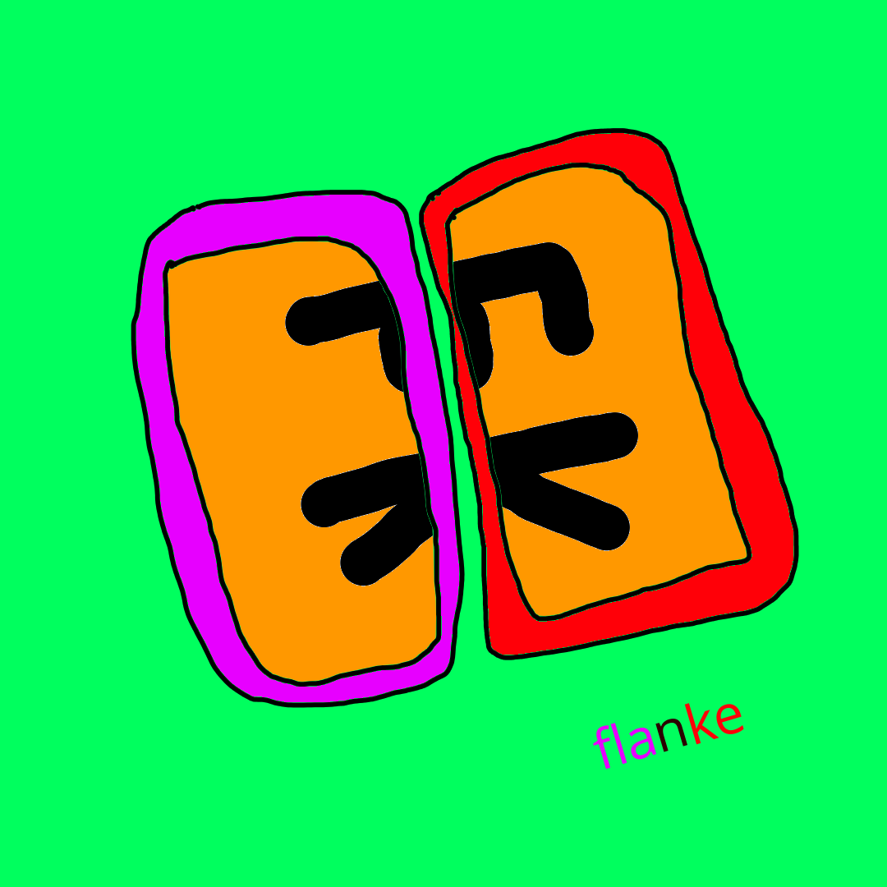

## Flanke: Connect multiple devices to form a bigger screen

### Introduction to Flanke

Flanke is an app and a website that enables the connection of multiple devices to form a unified, expansive display. This technology allows users to enjoy their preferred multimedia content, such as movies and games, on a large, seamless screen created by synchronizing their devices.

### Planned Functionality

The following features are currently in development for Flanke:

- Multi-Device Connectivity: Enable the formation of a single, expansive display by connecting multiple devices
- Seamless Video Rendering: Ensure uninterrupted video playback across all connected devices
- Real-Time Synchronization: Provide a lag-free experience through instantaneous synchronization of all connected devices
- Device Compatibility: Support for a wide range of devices
- Intuitive User Interface: Offer a user-friendly interface for effortless setup and control of the Flanke system

### Technical Overview

Flanke is currently in the early stages of development. Our team is actively exploring various technologies to bring this vision to life. We will provide regular updates on our progress.

### Development Roadmap

[ under construction ]

### License

Flanke is licensed under the [MIT License](license.md).

  

